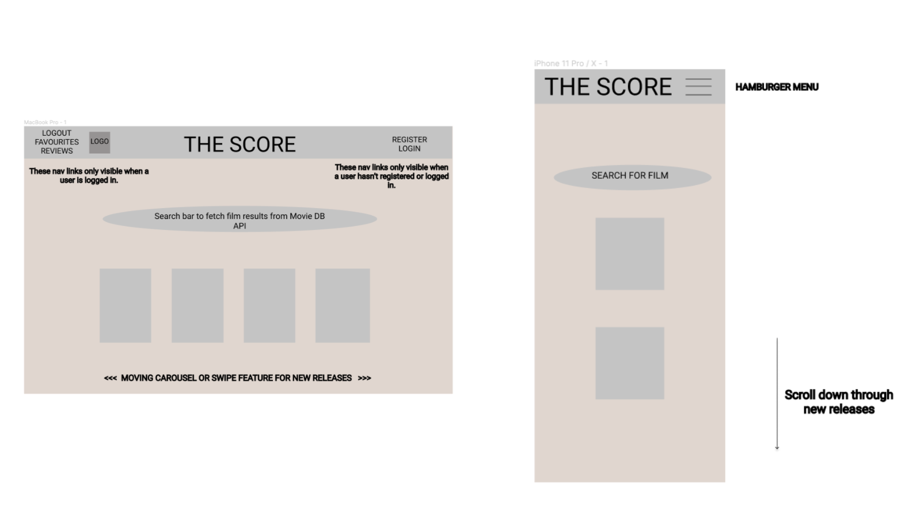
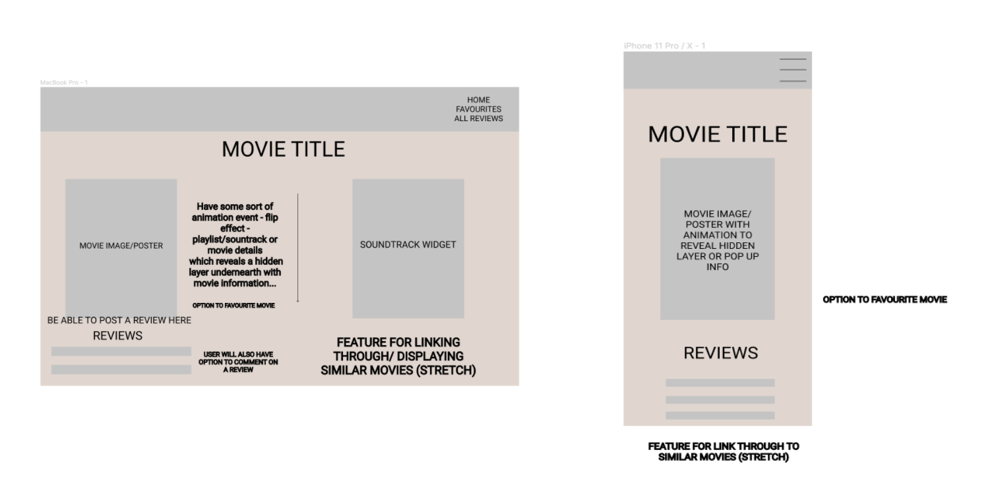
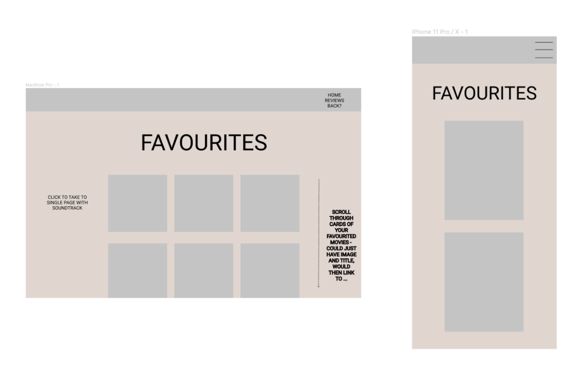
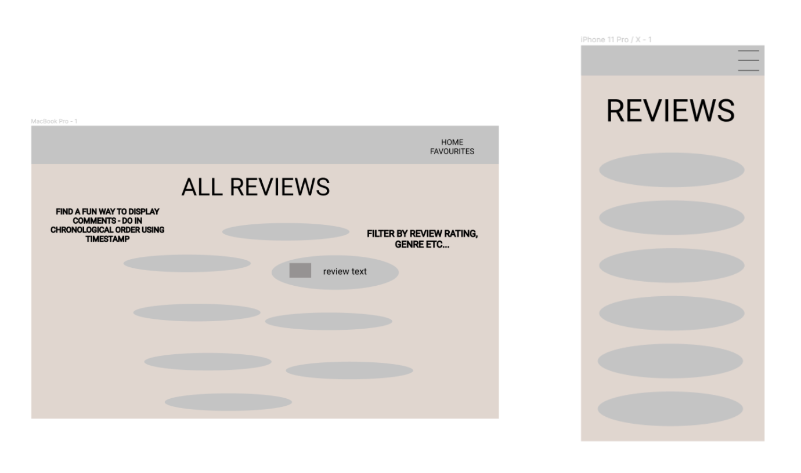
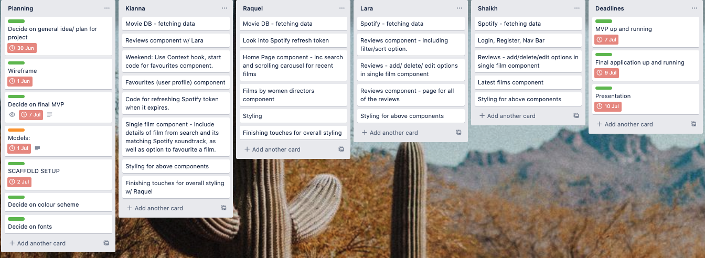
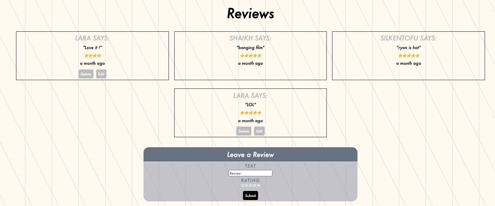
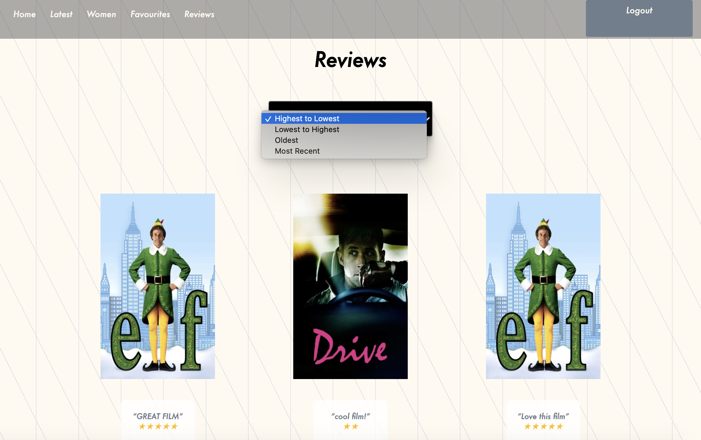

# Project 3 - The Score (A MERN Stack App)

# Overview

This MERN Stack app was the third project that I completed whilst at GA. This project was completed over the course of 7 days in a group of 4 people. To facilitate successful collaboration over the duration of the project, we used Trello to set ourselves task deadlines, Figma to wireframe our app and Git, GitHub, Slack and VSCode Live Share to facilitate communication whilst coding. 

As a team, we decided to create a movie soundtrack database that consumed the Spotify and MovieDB public API's. On this app, a user can search for film soundtracks, see recently released movies and films produced by women. Additionally, they are able to login, favourite and post/edit/delete comments on movies. My role focused on the commenting functionality of the app, in addition to helping with the styling and configuration of the app. 

You can view The Score [here](https://the--score.herokuapp.com/#/), or find the GitHub repository [here](https://github.com/larathompson/project-3). 

# Brief

Listed below are the requirement that our team had to meet whilst building the app:

We had to:

- Work in a team, using git to code collaboratively
- Build a full-stack application by making our own backend and frontend
- Use an express API to serve the data from a Mongo database
- Consume our API with a separate front-end built in React
- Build a complete product which had multiple relationships and CRUD functionality for at least some of the models 
- Implement thoughtful user stories/wireframes that were significant enough to know which features were core MVP and which could be cut
- Have a visually impressive design 
- Be deployed online so that it could be publicly accessible

# Technologies Used
- HTML
- React
- React Hooks
- CSS/SASS
- JavaScript
- Node.js
- Express
- Webpack
- Mongoose
- MongoDB
- Babel
- Insomnia
- JWT
- Axios
- Bcrypt for Node.js
- GitHub
- Git
- Trello
- Figma

# API's Used
- Spotify API
- MovieDB API

# Approach 

## Planning






As a team, we used Figma to wireframe our app. This was beneficial as it later allowed us to work independently on different components whilst ensuring our app had a consistent style. 

## Task Planning 



Throughout the duration of the project we used Trello to assign tasks to different members of the groups and had corresponding deadlines. This meant that we were confident that we could complete our app by the deadline. Additionally, it meant that we reduced the number of conflicts that occured during merges between our teams code when using GitHub. 

## App set-up

Whilst creating our app, we started by building the back-end. In order to use this, we used Mongoose, MongoDB, Express and Node.js. Whilst setting up the app, I took the lead in setting up the web-pack, package.json, server.js and seed.js and files. 

In order to create a design for the data we wanted stored, we created schemas - a user schema and a reviews schema. The user schema also used bcrypt and mongoose unique validator. This ensured that the user was not already stored in the database in addition to hashing the stored password after using a virtual field to check that the original password matched the password confirmation. 

```
const schema = new mongoose.Schema({
  username: { type: String, required: true, unique: true },
  email: { type: String, required: true, minLength: 8, unique: true },
  password: { type: String, required: true },
  favouriteMovies: { type: [Object] }
})
```
 n.b. -> originally we planned to create a feature whereby users could comment on reviews and therefore, we included this in the schema, however, this was a stretch goal which we did not achieve. 

```
const reviewSchema = new mongoose.Schema({
  text: { type: String, required: true },
  user: { type: mongoose.Schema.ObjectId, ref: 'User', required: true },
  rating: { type: Number, required: true },
  filmId: { type: String, required: true },
  film: { type: Object },
  comments: [ commentSchema ]
}, {
  timestamps: true
})
```

Once the models were created, we were able to create endpoints which performed CRUD actions, using Mongo to interact with our database. As we used a secure route, it meant that only logged in users could use certain functionalities of the app such as favouriting movies and posting/editing/deleting comments. 

## Controllers

### User Controllers
- `/register` (POST) --> registers a user
- `/login` (POST) --> allows user to login and receive a token
- `/favourites` (POST) --> allows users to post films to their favourites page
- `/profile` (GET)
- `/favourites` (POST)
- `/favourites/:filmId` (DELETE)

### Reviews Controllers
- `/reviews` (GET, POST) --> allows users to view all the reviews they posted and post new reviews
- `/review/:id` (GET, DELETE, PUT) --> allows users to view, delete or edit a review
- `/movie/reviews/:filmId` (GET, POST) --> allows all the reviews of a film to be displayed and for users to post reviews to the movie page

After collaborating to create the backend, we split off and worked independently to work on different front-end components. As mentioned, my focus was to create the review functionality of the app. 

## Reviews



As shown in the image, one each film page, all of the written reviews are displayed. Additionally, I used the Font Awesome star icon (`faStar`) to create an interactive rating system, whereby the logged-in user could rate a film on a scale of 1-5 stars. 

### View the reviews on the movie page:

In order to display information on the single movie page, we used `useEffect`. Within the useEffect, I did an `axios` GET request in order to get all the reviews written for a specific movie. 

```
axios.get(`api/movie/reviews/${filmId}`)
      .then(axiosResp => {
        setReviewData(axiosResp.data)

      })
```

The data provided into the response was stored in state (`const [reviewData, setReviewData] = useState([])`). By mapping over this data, I was able to display on the page the content of the reviews, the user who posted the review and by using the library `moment`, I was able to display how recently it was posted. 

### Post a review on the movie page:

In order to post a review, a user must be registered and logged in. When the user clicks on the 'Submit' button on the Review Form, the `handleComment` function is run. This retrieves the user's token from local storage, and then posts the content of the comment to the server. When posted, the text `setText` is reset to being a blank box and the rating `setRating` is set to its initial state of `0`. We then pushed the review into the `reviews` array and then reviewData is updated to include the new review. 

```
  function handleComment(filmId) {
    const token = localStorage.getItem('token')
    axios.post(`api/movie/reviews/${filmId}`, { text: text, filmId: props.match.params.id, rating: rating, film: movieData }, {
      headers: { Authorization: `Bearer ${token}` }
    })
      .then((axiosResponse) => {
        setText('')
        //!0 is when there is no rating yet - the initial state
        setRating(0)
        const reviews = [...reviewData]
        reviews.push(axiosResponse.data)
        setReviewData(reviews)
      })
```

### Edit and delete a review on the movie page:

```
function handleEdit(event) {
    const token = localStorage.getItem('token')
    const reviewId = event.target.value
    axios.put(`/api/review/${reviewId}`, { text: updatedText, rating: updatedRating }, { headers: { Authorization: `Bearer ${token}` } })
      .then((comment) => {
        setUpdatedText('')
        setUpdatedRating(Number)
        setIsEditing(false)
        const updatedReviews = reviewData.map((review, index) => {
          if (comment.data._id === review._id) {
            return comment.data
          } else {
            return review
          }

        })

        setReviewData([...updatedReviews])
        console.log(updatedReviews)

      })
  }
```

In order to edit a comment, the `handleEdit` function is called. By passing in the event, the `reviewId` can be accessed. A PUT request is then sent, passing in the updated comment and the updated rating alongside the authentication token. The response sent then updates the text, updates the rating to a number and sets editing to false (this means that you can submit the review when you have finished editing). 

`{(isLoggedIn() && isEditing === review._id && userInfo && userInfo.username === review.user.username) && <button onClick={handleEdit} value={review._id} className="submit-button">Submit</button>}`

In order to ensure you could only edit a review you had written, we wrote a `userCheck` function which checked that the logged in user was only editing/deleting the comment with the same user id of the person that posted it. 

```
  function userCheck(username) {
    return isLoggedIn() && userInfo && userInfo.username === username
  }

```

Similarly to the posting and editing reviews function, only logged in users can delete the comments which they had written. 

```
function handleDelete(event) {
    const token = localStorage.getItem('token')
    const reviewId = event.target.value
    axios.delete(`/api/review/${reviewId}`, { headers: { Authorization: `Bearer ${token}` } })
      .then(res => {
        setUserInfo(res.data)
      })
  }
```

### Star Rating

In order to do the interactive star rating, I created a separate component(`StarRating`) in order to split up our code. I used the react-icons library. 

To create the 5 stars, I made an array that had 5 untitled items in it and mapped over this (in order to create 5 stars) and returned from each of those a star. Behind each star I inserted a radio button which I hid using CSS. In order to know what the user rated the movie as, I used `onClick` to set the rating value as `i + 1 ` (as index starts at 0 but the first value is 1 star) and saved this rating in state. 

I also added a hover function (`onMouseEnter`) - this was a function that made the stars turn yellow when the mouse hovered over them and turned grey `onMouseLeave`. This hover value was also saved in state. 

```
const StarRating = ({ setRating, rating }) => {
  // const [rating, setRating] = useState(null)
  const [hover, setHover] = useState(null)
  return (
    <div>
      {[...Array(5)].map((star, i) => {
        const ratingValue = i + 1
        return <label key={i}>
          <input type="radio" name="rating" value={ratingValue}
            onClick={() => setRating(ratingValue)}

          />
          <FaStar className="star"
            color={ratingValue <= (hover || rating) ? '#ffc107 ' : '#e4e5e9'}
            size={15}
            onMouseEnter={() => setHover(ratingValue)}
            onMouseLeave={() => setHover(null)}
          />
        </label>
      })}
      {/* <p> The rating is: {rating} </p> */}

    </div>
  )

}
```


### Viewing all the reviews



The user also has an option to view all the reviews written on the app and is able to sort them by rating and the date the review was posted. In order to do this, a GET request in the `useEffect` retrieved all the reviews, saving them in state. 

The `handleSort` function sorts the array depending on by which method the user has chosen by using the `.sort` method on the 'sliced' filterReviews array (it had to be sliced in order to create a new, unchanged array). The `filterReviews` was then mapped over and displayed on the page in the appropriate way. 

```
 function handleSort(event) {
    console.log(filterReviews)
    console.log(event.target.value)
    const data = filterReviews.slice()
    if (event.target.value === 'oldest') {
      const old = data.sort((a, b) => new Date(a.updatedAt) - new Date(b.updatedAt))
      setFilterReviews(old)
    } if (event.target.value === 'most-recent') {
      const recent = data.sort((a, b) => new Date(b.updatedAt) - new Date(a.updatedAt))
      setFilterReviews(recent)
    } if (event.target.value === 'lowToHigh') {
      const low = data.sort((a, b) => a.rating - b.rating)
      setFilterReviews(low)

    } if (event.target.value === 'highToLow') {
      const high = data.sort((a, b) => b.rating - a.rating)
      setFilterReviews(high)
    }
  }
```

### Successes

This project was the most challenging on the course as we had to use more complex code, desigining and creating both the front-end and back-end, in addition to learning how best to work collaboratively in a large group. This project allowed me to develop a deeper understanding of how communication between the back-end and front-end occurs and I became more confident at researching and implementing new features that I learnt independently, such as the star rating feature. Additionally, I could clearly see the benefits of working collaboratively in projects - I was able to learn about `useContext` from another member of my team whilst learning how best to code and style collaboratively. As well as consolidating and learning new technical skills, I became confident at how to use Git to work as a team and we quickly learnt that planning and consistent communcation was essential in order to create a functional app that had consistent styling.

Furthermore, prior to the project, we were warned that the Spotify API was difficult to access. However, through perseverence and team-work, we were able to use it and I personally saw this as a big success. Having used the Deezer API in my previous project, this project demonstrated to me that I had become more confident with understanding technical documentation. 

### Bugs

- On the Favourites Page, the footer is mid-way up the page - this can be fixed with some CSS styling. 
- When the app is viewed on a mobile, the nav bar becomes less responsive and the styling of the buttons becomes inconsistent - this is due to the fact that we were rushed for time and could be fixed with styling. 

### Challenges and Lessons Learnt 

As this was the first project where we had worked in a group of 4, it took us a couple of days to come to terms with how best to communicate and collaborate. As this project was comprised of many different features, this resulted in us having conflicts when merging. We quickly understood the importance of consistently communicating and therefore, could resolve this issue. Additionally, as mentioned, the Spotify API was initally difficult to access and our token had to consistently be renewed. This took us a few days to resolve and made me recognise the importance of perseverence and time management; our team set deadlines which accounted for difficulties that may arise and with this forward-thinking, we were still able to create our MVP with some additional features. 

Finally, we were able to make the app both mobile and desktop responsive, however, due to time constraints, there are still a few features which could be improved upon. 


### Additional Features

Due to time constraints we were not able to implement all of the additional features that we would have liked. As shown on the review model, we were hoping to design a feature whereby users could comment on each others reviews - this is something that I would like to implement in the future. 


